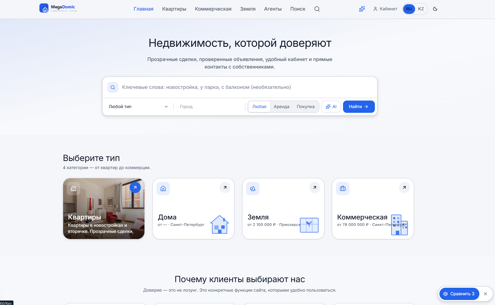

# MegaDomic — Real Estate Platform Template (Next.js + Payload CMS)


A production-grade real estate listings platform template, built on **Next.js 16** and **Payload CMS v3**. Five listing types (apartments, commercial, land, residential complexes, houses), a public catalog with SEO city landing pages, a self-serve user cabinet with realtor messaging, AI-powered semantic search, and a CMS-driven page builder — everything a real estate agency or marketplace needs as a starting point.



📺 **Video walkthrough:**

<a href="https://youtu.be/onsBNegQaUo">
  
</a>

## Standout features

- 🚀 **Zero-touch CI/CD** — push to `main` and GitHub Actions builds a Docker image (with layer caching), pushes it to GHCR, then SSHes into the server to pull, health-check, and automatically run migrations — with automatic rollback to a previous image tag and old-image cleanup built in. No manual deploy steps.
- 🧩 **Real drag-and-drop page building** — 25+ CMS content blocks (hero variants, testimonials, FAQ, amenities, vision/mission, and more) that editors reorder and configure entirely from the Payload admin UI. Building a new marketing page is a content task, not an engineering task.
- 🤖 **AI-agent-ready from day one** — ships with a dedicated [`llms.txt`](llms.txt) plus [`CLAUDE.md`](CLAUDE.md) and [`PROJECT_MAP.md`](PROJECT_MAP.md): a machine-readable map of the architecture, domain model, and hard-won gotchas, so an AI coding agent (or a new human contributor) can safely operate on the whole codebase from its first session instead of re-discovering everything by trial and error.
- 🧠 **AI semantic search** — understands natural-language queries like *"2-bedroom near a park, under 10M"*, parses them into structured filters, and ranks results by vector similarity (pgvector), not just keyword matching
- ✨ **AI recommendation assistant** — a conversational "pick for me" helper that factors in a visitor's saved favorites and recently-viewed listings, not a one-shot search box
- ✍️ **Fact-grounded AI content generation** — bulk-generates SEO landing pages (city × filter combinations) by first pulling real stats from the database (active listing count, price range/median, top districts) and feeding *that* to the LLM, so the copy is grounded in actual inventory instead of hallucinated — at roughly $0.05 per 100 pages
- 📡 **Legal, scraper-free listing import** — agencies migrate off other platforms by pointing the importer at their own hosted Yandex.Realty YML or Avito XML feed (or a plain CSV), no scraping involved
- 🧹 **Self-cleaning catalog** — a maintenance job auto-expires stale listings and flags likely duplicates by fuzzy address matching, runnable on a schedule via a single cron-secured endpoint
- 🔔 **Saved-search email alerts** — visitors save a filtered search and get notified (instantly, daily, or weekly — their choice) the moment a new matching listing appears
- 🌍 **Content-level bilingual CMS** — RU/KZ isn't just translated UI chrome: every listing, page, and nav item is a Payload-localized field, so an agency can maintain fully separate copy per locale, per record, straight from the admin panel
- 👁️ **Live preview across breakpoints** — edit a page in the admin and watch it re-render live at mobile/tablet/desktop widths before you publish
- 🐳 **One command, full local stack** — `docker compose up` gets you Postgres+pgvector, the embeddings server, pgAdmin, and the app together — no piecing together infra by hand

## Key technologies

- **Next.js 16** (App Router, React Server Components, Turbopack)
- **React 19** + **TypeScript** (strict mode)
- **Payload CMS v3** with the Postgres/Drizzle adapter, plus plugins: SEO, Search, Redirects, Nested Docs, Form Builder
- **PostgreSQL** with **pgvector** — powers AI semantic search and similar-listing recommendations
- **Tailwind CSS** + Radix UI + Lucide Icons
- **AI search & recommendations**: HuggingFace text-embeddings-inference (multilingual embeddings) for semantic search, with optional Anthropic Claude / OpenAI integration for natural-language query parsing and recommendation explanations — gracefully falls back to keyword search when unconfigured
- **Maps**: Mapbox GL
- **Email**: Resend (magic-link cabinet login, saved-search digests)
- **OAuth**: Google, Yandex, Mail.ru
- **i18n**: next-intl routing (RU default / KZ) + Payload localized fields, so both the site chrome and CMS content support multiple locales out of the box
- **Notifications**: optional Telegram bot integration for per-city listing publishing
- **Docker Compose** for local dev (Postgres, pgAdmin, embeddings server, app)

## What's included

- **Five listing collections** — flats, commercial, land, residential complexes (ЖК), houses — each with its own tailored field schema (not a forced generic "property" base), UGC submission flow, and moderation status
- **Public catalog** — filterable listing search, split map/list view, programmatic SEO city landing pages, sitemaps
- **AI-powered search** — semantic (embeddings) search with natural-language query parsing ("2-bedroom near a park, under 10M"), plus a conversational AI recommendation assistant, both with a keyword-search fallback when AI isn't configured
- **User cabinet** — passwordless magic-link + OAuth login, saved searches, favorites, realtor messaging, self-serve listing submission with moderation
- **Realtor/agent pages** — profiles, ratings, reviews, active-listing counts
- **CMS page builder** — 25+ reusable content blocks (hero variants, testimonials, FAQ, amenities, vision/mission, etc.) for building marketing pages without touching code
- **Blog** — posts, categories, pagination
- **Localization** — RU/KZ routing and Payload-localized content fields, ready for a full translation pass
- **Legal/compliance scaffolding** — configurable company legal info, privacy/terms pages, cookie consent
- **Analytics-ready** — Yandex Metrika + Google Analytics 4 hooks
- **Listing import & data ops** — bulk CSV import, legal feed import (Yandex.Realty/Avito), a rule-based (no-LLM, free) instant description generator, and a cron-friendly maintenance endpoint for stale-listing expiry and duplicate detection
- **Demo data seed endpoints** — populate a fresh database with realistic listings, agents, and reviews in a few requests

## Quick Start

**Prerequisites:** Node.js 20+, pnpm, Docker (for Postgres/pgvector).

1. **Install dependencies**
   ```bash
   pnpm install
   ```

2. **Configure environment**
   ```bash
   cp .env.example .env
   ```
   At minimum, set `PAYLOAD_SECRET`, `CRON_SECRET`, `PREVIEW_SECRET`, and the Postgres credentials. Everything else (AI search, email, OAuth, maps, Telegram) is optional — the app degrades gracefully when a given integration's env vars are left empty.

3. **Start the database**
   ```bash
   docker compose up -d postgres
   ```

4. **Run migrations**
   ```bash
   pnpm payload migrate
   ```

5. **Start the dev server**
   ```bash
   pnpm dev
   ```
   - Frontend: http://localhost:3000
   - Admin panel: http://localhost:3000/admin

6. **Create your first admin user** — there's no first-user setup wizard in this fork's flow; use the Payload Local API once (see [SETUP.md](SETUP.md) for the exact snippet), or sign up your first user directly from `/admin`.

7. **(Optional) Seed demo content** — with the dev server running, POST to the seed endpoints in order (globals → cities/pages → posts/listings). See [SETUP.md](SETUP.md) and [START_GUIDE.md](START_GUIDE.md) for the full list and ordering — these endpoints are open in development and gated behind `CRON_SECRET` in production.

8. **Build for production**
   ```bash
   pnpm build
   pnpm start
   ```

For a deeper orientation (architecture, gotchas, full setup detail including Docker vs. local Postgres), see [CLAUDE.md](CLAUDE.md), [llms.txt](llms.txt), [PROJECT_MAP.md](PROJECT_MAP.md), and [SETUP.md](SETUP.md).

## Contributing

Pull requests for bug fixes and new features are welcome. Please follow the existing code style, and run `npx eslint .`, `NODE_OPTIONS=--no-deprecation npx tsc --noEmit`, and `pnpm test:unit` before submitting.

## License

Free to use as a template in your own projects, personal or otherwise. **Commercial use requires the explicit prior consent of the author, neuraCollab.** See [LICENSE](LICENSE) for the full terms.
